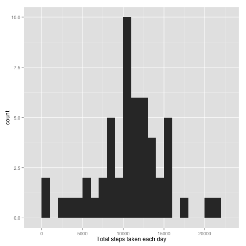
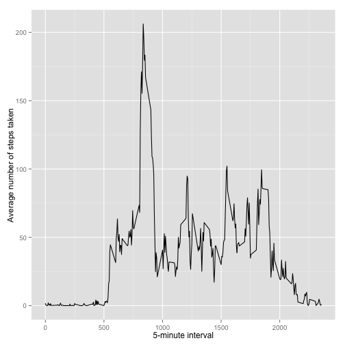
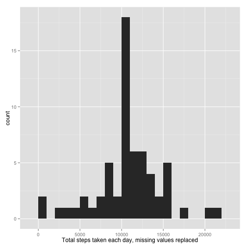
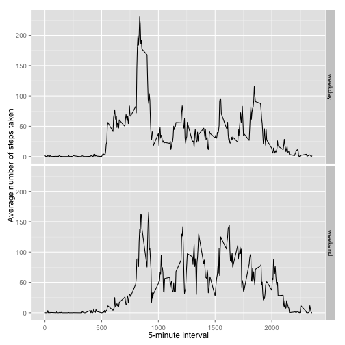

## Loading and preprocessing the data
Load the CSV file

```r
rawData <- read.csv("activity.csv", colClasses = c("numeric", "character", "numeric"))
```

Quick look at how the data table looks like:

```r
head(rawData)
```

```
##   steps       date interval
## 1    NA 2012-10-01        0
## 2    NA 2012-10-01        5
## 3    NA 2012-10-01       10
## 4    NA 2012-10-01       15
## 5    NA 2012-10-01       20
## 6    NA 2012-10-01       25
```

Convert the dates in the "date" column to date objects

```r
rawData$date <- as.Date(rawData$date, "%Y-%m-%d")
```

## What is mean total number of steps taken per day?
Take the total number of steps using the aggregate function, passing the sum function as an argument

```r
totalSteps <- aggregate(steps ~ date, data = rawData, sum, na.rm = TRUE)
```

Histogram of the total steps taken each day

```r
#Plot
library(ggplot2)
```

```
## Warning: package 'ggplot2' was built under R version 3.1.2
```

```r
qplot(totalSteps$steps, binwidth=1000, xlab="Total steps taken each day")
```

 

And now we calculate the mean and median

```r
meanSteps <- mean(totalSteps$steps, na.rm=TRUE)
medianSteps <- median(totalSteps$steps, na.rm=TRUE)
```

The mean is 1.0766189 &times; 10<sup>4</sup> and the median is 1.0765 &times; 10<sup>4</sup>

## What is the average daily activity pattern?
Series plot of the 5-minute interval and average number of steps taken, averaged across all days

```r
averageSteps <- aggregate(x=list(steps=rawData$steps), by=list(interval=rawData$interval),
                      FUN=mean, na.rm=TRUE)

ggplot(data=averageSteps, aes(x=interval, y=steps)) +
  geom_line() +
  xlab("5-minute interval") +
  ylab("Average number of steps taken")
```

 

And now we find out the 5-minute interval with the maximum number of steps

```r
averageSteps[which.max(averageSteps$steps),]
```

```
##     interval    steps
## 104      835 206.1698
```


## Imputing missing values
Let's calculate the number of missing values first:

```r
missingStepsValues <- rawData[is.na(rawData$steps),]
```
The number of observations with missing steps values is 2304

Replace the NA values with the mean of its 5 minute interval

```r
avgStepsInInterval <- aggregate(steps ~ interval, data = rawData, FUN = mean)
filledNAs <- numeric()
for (i in 1:nrow(rawData)) {
    currentRow <- rawData[i, ]
    if (is.na(currentRow$steps)) {
        steps <- subset(avgStepsInInterval, interval == currentRow$interval)$steps
    } else {
        steps <- currentRow$steps
    }
    filledNAs <- c(filledNAs, steps)
}

correctedData <- rawData
correctedData$steps <- filledNAs
```

Repeat the histogram of the total steps taken each day

```r
correctedTotalSteps <- aggregate(steps ~ date, data = correctedData, sum, na.rm = TRUE)
library(ggplot2)
qplot(correctedTotalSteps$steps, binwidth=1000, xlab="Total steps taken each day, missing values replaced")
```

 

Mean and Median with missing values replaced:


```r
correctedMeanSteps <- mean(correctedTotalSteps$steps, na.rm=TRUE)
correctedMedianSteps <- median(correctedTotalSteps$steps, na.rm=TRUE)
```

The mean is 1.0766189 &times; 10<sup>4</sup> and the median is 1.0766189 &times; 10<sup>4</sup>

As we can see, the mean remains the same, but the median varies slightly after replacing the missing values.

## Are there differences in activity patterns between weekdays and weekends?
To classify the days I'll create a function that leverages the weekdays function and use it to classify the days

```r
classifyDay <- function(date) {
  day <- weekdays(date)
  weekDays = c("Monday", "Tuesday", "Wednesday", "Thursday", "Friday")
  weekEndDays = c("Saturday", "Sunday")
  if(day %in% weekDays)
    return ("weekday")
  else if (day %in% weekEndDays)
    return ("weekend")
  else 
    stop("invalid date!")
}
datesInCorrectedData <- as.Date(correctedData$date)
correctedData$dayType <- sapply(correctedData$date, FUN=classifyDay)
```

Let's see how the data looks with the classify date

```r
head(correctedData)
```

```
##       steps       date interval dayType
## 1 1.7169811 2012-10-01        0 weekday
## 2 0.3396226 2012-10-01        5 weekday
## 3 0.1320755 2012-10-01       10 weekday
## 4 0.1509434 2012-10-01       15 weekday
## 5 0.0754717 2012-10-01       20 weekday
## 6 2.0943396 2012-10-01       25 weekday
```

Now let's make the time series again, but using the corrected data and splitting the graph between weekdays and weekends:

```r
correctedAverageSteps <- aggregate(steps ~ interval + dayType, data = correctedData, mean)

ggplot(correctedAverageSteps, aes(interval, steps)) + 
  geom_line() + 
  facet_grid(dayType ~ .) +
  xlab("5-minute interval") + 
  ylab("Average number of steps taken")
```

 

